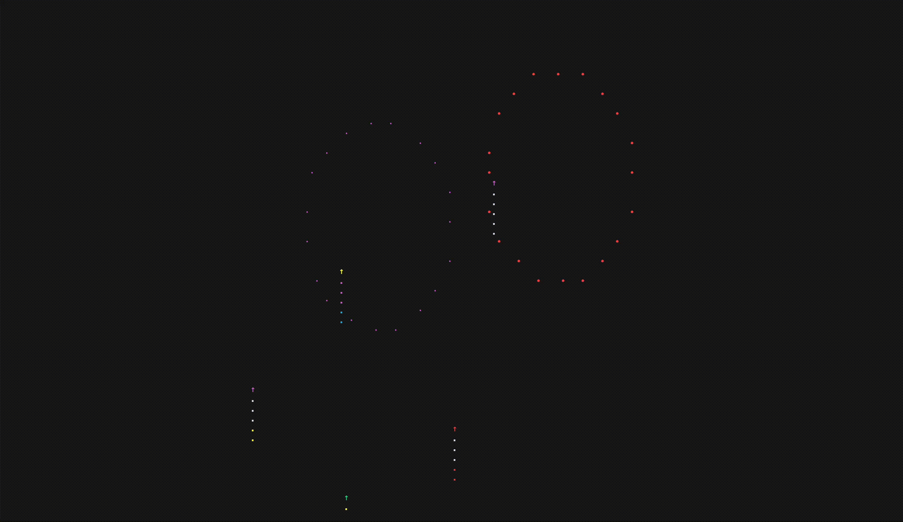

# Firework

A terminal-based firework simulation program written in Rust. Through character animation and vibrant colors, it creates dazzling firework effects in the terminal, hoping to bring you some joy!

## Demo



The above GIF shows the program in action.

## Features

- 🎆 Colorful firework effects, each firework uses 2-3 similar color tones
- 🎇 Realistic physics effects: firework launch, explosion, particle dispersion
- 🌈 Multiple color combinations, including red, green, blue, yellow, pink, and cyan series
- 🔄 Multi-stage explosion effects, simulating the continuous explosion of real fireworks
- 🚀 Smooth animation effects, fluid visual experience

## Implementation

The project mainly uses the following technologies:

- `crossterm` library for terminal control and color rendering
- `rand` library for randomly generating various attributes of fireworks

The firework simulation is based on a simple physics system, using characters and colors to represent firework particles. By calculating the velocity, position, and brightness changes of particles, it simulates the visual effect of real fireworks.

## Project Structure

The project is modularized by functionality:

- `types.rs`: Defines basic data structures and types
- `particle.rs`: Implements particle behavior logic
- `firework.rs`: Implements firework generation, explosion, and rendering
- `app.rs`: Main application logic, handles user input and animation loops
- `main.rs`: Program entry point

## How to Run

Running this program is very simple:

1. Make sure Rust and Cargo are installed
2. Clone this repository
3. Execute in the project directory:

```bash
cargo run
```

4. The effect looks better on terminals with a dark background

## Controls

- Press `q` to exit the program
- Press `Ctrl+C` to force quit the program

## License

This project is licensed under the MIT License. See the LICENSE file for details.

## Other Languages

- [中文文档](./README.md)
